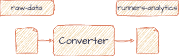

# Converter

In this Kafka streams application we will consume the data from `raw-data` topic and convert the JSON schema into a
compact [Avro schema](https://github.com/bakdata/kafka-lab/tree/main/common/src/main/avro). We will remove the
unnecessary fields (longitude, latitude, attitude) and just keep the fields we
need.

## Resources

- [Streams bootstrap Kafka Streams](https://github.com/bakdata/streams-bootstrap#kafka-streams)
- [Kafka Error Handling](https://github.com/bakdata/kafka-error-handling)
- [Kafka Streams basic operations](https://developer.confluent.io/courses/kafka-streams/basic-operations/)
- [mapValues](https://kafka.apache.org/20/javadoc/org/apache/kafka/streams/kstream/KStream.html#mapValues-org.apache.kafka.streams.kstream.ValueMapper-)
