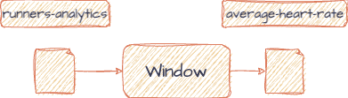

# Windowing

In the final step of the pipeline we will consume the `runners-analytics` topic
and based on
the [`run_time`](https://github.com/bakdata/kafka-lab/blob/main/common/src/main/avro/runners-status.avsc#L27)
we will window the data and calculate the average heart rate.

## Resources

- [Set a new key with selectKey](https://kafka.apache.org/20/javadoc/org/apache/kafka/streams/kstream/KStream.html#selectKey-org.apache.kafka.streams.kstream.KeyValueMapper-)
- [JavaDocs for groupByKey](https://kafka.apache.org/20/javadoc/org/apache/kafka/streams/kstream/KStream.html#groupByKey--)
- [Defining windows in Kafka Streams](https://developer.confluent.io/courses/kafka-streams/windowing/)
- [Windowing concepts in Kafka Streams](https://www.confluent.io/blog/windowing-in-kafka-streams/)
- [Compute an average aggregation](https://developer.confluent.io/tutorials/aggregating-average/kstreams.html#:~:text=To%20calculate%20the%20running%20average,%2C%20CountAndSum%3E%20ratingCountAndSum%20%3D%20ratingsById.)
- [Example code of Kafka Stream Windowing DSL](https://github.com/Programming-with-Mati/bank-transactions-queries/blob/windows/src/main/java/com/github/programmingwithmati/topology/BankBalanceTopology.java)
